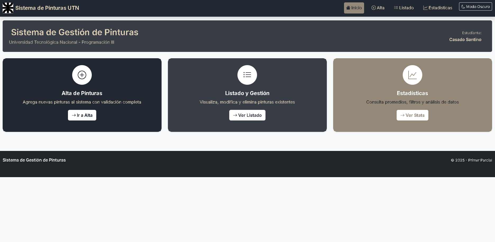
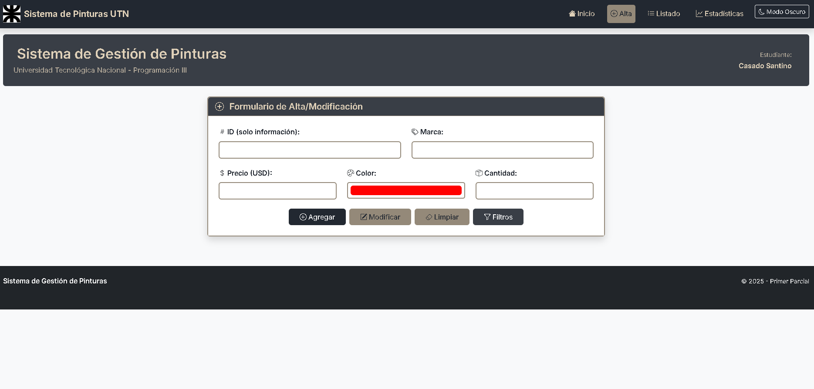
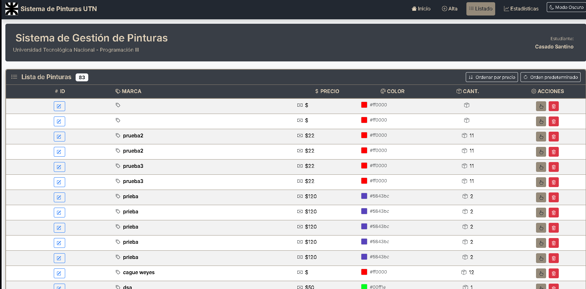
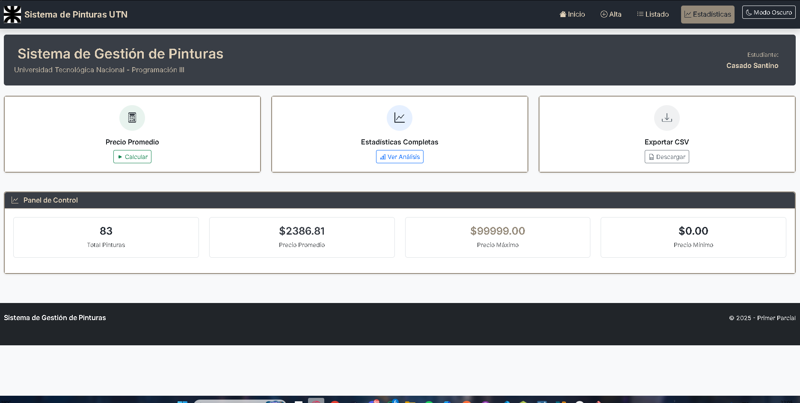

# 🎨 Sistema de Gestión de Pinturas - UTN

**Programación III - Primer Parcial**  
**Autor:** Casado Santino  
**Fecha:** Octubre 2025

---

## 📋 Descripción del Proyecto

Sistema web completo para la gestión de inventario de pinturas desarrollado con tecnologías web modernas. Permite realizar operaciones CRUD (Crear, Leer, Actualizar, Eliminar) sobre un catálogo de pinturas, con funcionalidades avanzadas de filtrado, ordenamiento y análisis estadístico.

---

## 🏗️ Estructura del Proyecto

```
PrimerParcial_PrograII_CasadoSantino/
│
├── 📄 pintureria.html          # Página principal (SPA)
├── 📄 README.md                # Documentación del proyecto
│
├── 📁 css/
│   └── style.css               # Estilos personalizados y variables CSS
│
├── 📁 js/
│   └── manejadora.js           # Lógica principal de la aplicación
│
├── 📁 img/
│   └── (imágenes del proyecto) # Capturas de pantalla y recursos
│
└── 📁 backup/
    └── (archivos de respaldo)  # Versiones anteriores del código
```

---

## ⚙️ Tecnologías Utilizadas

### Frontend

- **HTML5**: Estructura semántica y accesible
- **CSS3**: Estilos modernos con variables personalizadas
- **Bootstrap 5.3.2**: Framework responsive y componentes UI
- **Bootstrap Icons**: Iconografía consistente
- **JavaScript ES6+**: Programación moderna con async/await

### Backend/API

- **API REST**: https://utnfra-api-pinturas.onrender.com/pinturas
- **Fetch API**: Comunicación asíncrona con el servidor

---

## 🚀 Funcionalidades Principales

### 1. 🏠 **Dashboard Interactivo**

- Navegación intuitiva por pestañas
- Resumen visual del estado del inventario
- Accesos rápidos a las funcionalidades principales

### 2. ➕ **Gestión de Pinturas (CRUD)**

- **Crear**: Agregar nuevas pinturas al inventario
- **Leer**: Visualizar listado completo con paginación
- **Actualizar**: Modificar datos de pinturas existentes
- **Eliminar**: Remover pinturas con confirmación

### 3. 📊 **Sistema de Filtros y Ordenamiento**

- **Filtrar por marca**: Búsqueda específica de productos
- **Ordenar por precio**: De menor a mayor automáticamente
- **Mostrar todas**: Restaurar vista completa del inventario

### 4. 📈 **Análisis Estadístico**

- **Contador total**: Número de pinturas en inventario
- **Cálculo de promedio**: Precio promedio del catálogo
- **Vista detallada**: Estadísticas completas por categorías
- **Exportación CSV**: Descarga de datos para análisis externo

### 5. 🎭 **Experiencia de Usuario**

- **Modo oscuro/claro**: Alternancia de temas visuales
- **Alertas contextuales**: Notificaciones de estado
- **Formularios validados**: Validación en tiempo real
- **Diseño responsive**: Adaptable a todos los dispositivos

---

## 📱 Capturas de Pantalla

### 🏠 Dashboard Principal


_Vista principal con navegación por pestañas y resumen estadístico_

### ➕ Formulario de Alta/Modificación


_Interfaz para agregar y modificar pinturas con validación_

### 📋 Listado de Pinturas


_Tabla interactiva con opciones de edición y eliminación_

### 📊 Panel de Estadísticas


_Análisis detallado del inventario con exportación CSV_

### 🎭 Modo Oscuro


_Tema oscuro para mejor experiencia visual_

---

## 🏛️ Arquitectura del Sistema

### 📂 **Organización del Código JavaScript**

El archivo `manejadora.js` está estructurado en 12 secciones organizadas:

1. **Configuración y Constantes**: URL base y configuraciones globales
2. **Variables Globales**: Estado de la aplicación
3. **Constantes DOM**: IDs de elementos para mejor mantenimiento
4. **Elementos del DOM**: Referencias a elementos HTML
5. **Inicialización**: Setup inicial de la aplicación
6. **Funciones Asíncronas**: Comunicación con la API
7. **Funciones de Formulario**: Validación y manejo de datos
8. **Funciones de Filtros**: Búsqueda y ordenamiento
9. **Funciones de Interfaz**: Navegación y UX
10. **Funciones de Estadísticas**: Cálculos y análisis
11. **Funciones de Utilidad**: Modo oscuro y exportación
12. **Funciones Auxiliares**: Helpers y utilidades

### 🔄 **Flujo de Datos**

```
Usuario → Interfaz → Validación → API → Respuesta → Actualización UI
```

### 🛡️ **Validaciones Implementadas**

- **Marca**: Campo obligatorio, mínimo 3 caracteres
- **Precio**: Rango válido entre $1 y $50,000
- **Color**: Selector visual con valores hexadecimales
- **Cantidad**: Entre 1 y 400 unidades

---

## 🎯 Características Técnicas Destacadas

### 💡 **Programación Moderna**

- **Event Listeners**: Eliminación completa de `onclick` inline
- **Async/Await**: Manejo asíncrono elegante de APIs
- **Const/Let**: Variables con scope apropiado
- **Template Literals**: Strings dinámicos y legibles
- **Fetch API**: Comunicación moderna con servicios REST

### 🔧 **Patrones de Diseño**

- **Separación de responsabilidades**: HTML, CSS y JS independientes
- **Módulos funcionales**: Código organizado por funcionalidad
- **Event Delegation**: Manejo eficiente de eventos dinámicos
- **Estado centralizado**: Gestión coherente de datos

### 🚨 **Manejo de Errores**

- **Try/Catch**: Captura elegante de excepciones
- **Validación de respuestas**: Verificación de integridad de datos
- **Mensajes de usuario**: Feedback claro sobre errores
- **Recuperación automática**: Restauración de estado en fallos

---

## 📚 Aprendizajes del Estudiante

### 🎓 **Conocimientos Técnicos Adquiridos**

#### **JavaScript Avanzado**

- **Programación asíncrona**: Dominio de Promises, async/await y manejo de APIs REST
- **Manipulación del DOM**: Creación dinámica de elementos y manejo eficiente de eventos
- **Validación de formularios**: Implementación de validaciones complejas en tiempo real
- **Gestión de estado**: Mantenimiento coherente del estado de la aplicación

#### **Desarrollo Web Moderno**

- **Bootstrap Framework**: Utilización avanzada de componentes y sistema de grid responsive
- **CSS Variables**: Implementación de temas dinámicos y mantenimiento eficiente de estilos
- **Arquitectura SPA**: Desarrollo de Single Page Application con navegación fluida
- **APIs RESTful**: Integración completa con servicios web externos

#### **Buenas Prácticas de Programación**

- **Código limpio**: Escritura de código legible, mantenible y bien documentado
- **Separación de responsabilidades**: Organización clara entre presentación, lógica y datos
- **Manejo de errores**: Implementación robusta de tratamiento de excepciones
- **Optimización de rendimiento**: Técnicas para mejorar la experiencia del usuario

### 🌱 **Habilidades Desarrolladas**

#### **Resolución de Problemas**

- **Análisis de requerimientos**: Traducción de necesidades de negocio a soluciones técnicas
- **Debugging avanzado**: Uso de herramientas de desarrollo para identificar y resolver bugs
- **Optimización de código**: Eliminación de redundancias y mejora de la eficiencia
- **Testing manual**: Verificación exhaustiva de funcionalidades

#### **Experiencia de Usuario (UX)**

- **Diseño responsivo**: Adaptación a diferentes dispositivos y tamaños de pantalla
- **Accesibilidad**: Implementación de prácticas para usuarios con diferentes capacidades
- **Feedback visual**: Desarrollo de interfaces que comunican efectivamente el estado del sistema
- **Usabilidad**: Creación de flujos intuitivos y eficientes para el usuario final

### 🚀 **Competencias Profesionales**

#### **Gestión de Proyectos**

- **Planificación**: Estructuración de tareas y estimación de tiempos
- **Versionado de código**: Uso de respaldos y control de cambios
- **Documentación**: Creación de documentación técnica completa y clara
- **Testing**: Implementación de pruebas manuales sistemáticas

#### **Trabajo con APIs**

- **Integración de servicios**: Conexión efectiva con APIs externas
- **Manejo de datos**: Transformación y validación de información
- **Gestión de estados HTTP**: Comprensión y manejo de códigos de respuesta
- **Optimización de peticiones**: Implementación de cache y mejores prácticas

### 🎯 **Reflexión Personal**

Este proyecto representó un desafío integral que permitió aplicar conocimientos teóricos en un contexto práctico real. Los principales aprendizajes incluyen:

1. **Importancia de la planificación**: Una arquitectura bien pensada facilita enormemente el desarrollo
2. **Valor del código limpio**: El tiempo invertido en organización se recupera en mantenimiento
3. **Relevancia de la experiencia de usuario**: Las funcionalidades técnicas deben traducirse en valor para el usuario
4. **Necesidad de manejo de errores**: Los sistemas robusten requieren contemplar escenarios de falla

El desarrollo de este sistema consolidó mi comprensión de las tecnologías web modernas y me preparó para enfrentar proyectos de mayor complejidad en el ámbito profesional.

---

## 🚀 Instrucciones de Uso

### **Instalación**

1. Descargar el proyecto completo
2. Abrir `pintureria.html` en un navegador moderno
3. Asegurar conexión a internet para la API

### **Navegación**

- **Inicio**: Dashboard con resumen general
- **Alta**: Formulario para agregar/modificar pinturas
- **Listado**: Tabla interactiva con todas las pinturas
- **Estadísticas**: Análisis y exportación de datos

### **Funcionalidades Clave**

- Hacer clic en el ID de una pintura para editarla
- Usar los botones de filtro para búsquedas específicas
- Alternar entre modo claro y oscuro en la esquina superior
- Exportar datos a CSV desde el panel de estadísticas

---

## 📞 Contacto

**Estudiante**: Casado Santino  
**Materia**: Programación III  
**Institución**: Universidad Tecnológica Nacional (UTN)  
**Año**: 2025

---

## 📄 Licencia

Este proyecto fue desarrollado con fines académicos para la materia Programación III de la UTN.

---
